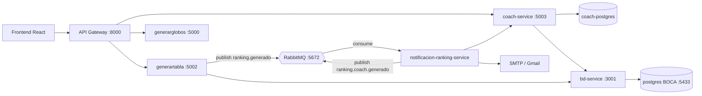

# Documentación Previo 2 — RPC SocialStream

## Descripción del proyecto

RPC SocialStream es un sistema de microservicios para la gestión y visualización de rankings de la competencia de programación RPC. El sistema permite registrar coaches con sus equipos, generar tablas de ranking y notificar automáticamente a los coaches mediante eventos RabbitMQ cuando se produce un nuevo ranking, incluyendo tanto el ranking general como el ranking filtrado por sus equipos.

## Arquitectura



## Modelo de datos — coach-service

**Tabla `coaches`**

| Campo          | Tipo         | Descripción                    |
|----------------|--------------|--------------------------------|
| id             | Integer (PK) | Identificador único            |
| nombre         | String(80)   | Nombre del coach               |
| apellido       | String(80)   | Apellido del coach             |
| login          | String(50)   | Login único                    |
| password_hash  | String(255)  | Hash bcrypt de la contraseña   |
| email          | String(120)  | Email único                    |
| pais           | String(60)   | País del coach                 |
| universidad    | String(120)  | Universidad del coach          |

**Tabla `coach_teams`**

| Campo            | Tipo         | Descripción                              |
|------------------|--------------|------------------------------------------|
| id               | Integer (PK) | Identificador único                      |
| coach_id         | Integer (FK) | Referencia a `coaches.id`                |
| team_usernumber  | Integer      | `usernumber` del equipo en BD BOCA       |
| team_fullname    | String(200)  | Nombre completo del equipo               |

> `team_usernumber` apunta a `usertable.usernumber` de la BD BOCA, pero sin FK (BDs distintas).

## Mapeo HU → implementación

| HU | Descripción | Implementación |
|----|-------------|----------------|
| HU1 | Coach inscripción | `coach-service` POST /coaches + `frontend/src/pages/CoachRegister.jsx` |
| HU2 | Notificación automática por email | `generartabla` publica `ranking.generado` → `notificacion-ranking-service` consume → SMTP |
| HU3 | Estadísticas por coach | `notificacion-ranking-service.filtrar_por_coach()` + cola `ranking_coach_queue` |

## Comandos para correr y probar

```bash
# 1. Levantar todo
docker compose up -d --build

# 2. Verificar todos los servicios
docker compose ps

# 3. Listar equipos disponibles
curl http://localhost:8080/api/teams | head -c 500

# 4. Registrar un coach de prueba
curl -X POST http://localhost:8080/api/coaches \
  -H "Content-Type: application/json" \
  -d '{
    "nombre":"Juan","apellido":"Pérez","login":"jperez","password":"test1234",
    "email":"jperez@test.com","pais":"Colombia","universidad":"UFPS",
    "teams":[{"usernumber":1,"fullname":"Equipo Demo"}]
  }'

# 5. Disparar generación de ranking
curl -X POST http://localhost:5002/generate

# 6. Ver logs del consumer
docker compose logs -f notificacion-ranking-service

# 7. RabbitMQ UI: http://localhost:15672 (rpc/rpc1234)

# 8. Frontend registro coach: http://localhost:8080/coach/register
```

## Servicios y puertos

| Servicio                    | Puerto | Descripción                         |
|-----------------------------|--------|-------------------------------------|
| postgres (BOCA)             | 5433   | BD solo lectura del juez BOCA       |
| bd                          | 3001   | Intermediario Node.js a Postgres    |
| generarglobos               | 5000   | Flask — genera globos PNG           |
| generartabla                | 5002   | Flask — genera ranking PNG + publica evento |
| api-gateway                 | 8000   | Flask — proxy hacia todos los servicios |
| frontend                    | 8080   | React + Vite + Nginx                |
| rabbitmq (AMQP)             | 5672   | Broker de mensajes                  |
| rabbitmq (UI)               | 15672  | Interfaz de administración          |
| coach-postgres              | —      | PostgreSQL interno del coach-service |
| coach-service               | 5003   | FastAPI — CRUD de coaches           |
| notificacion-ranking-service| —      | Consumer RabbitMQ + emails          |

## Notas

- La BD BOCA es **solo lectura**. Los coaches viven en `coach-postgres` (BD separada).
- Sin SMTP configurado, el consumer corre en modo **mock** (solo loggea) — útil para sustentación.
- Para Gmail: usar App Passwords en `SMTP_PASS`. Crear `.env` en la raíz con `SMTP_USER`, `SMTP_PASS`, `FROM_ADDR`.
